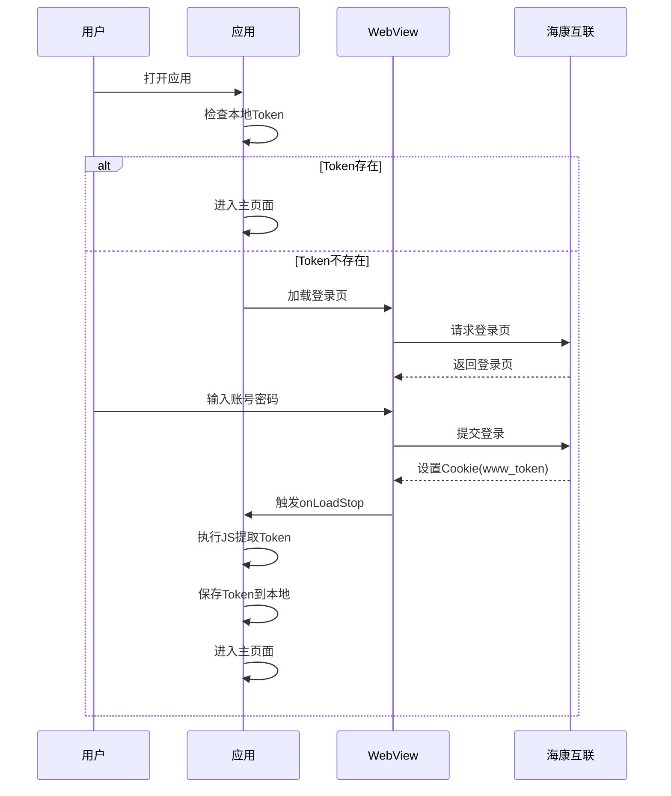

# 📱 华云工时查询工具 - 项目详细文档

> **项目名称**: hikiot_worktime  
> **版本**: 2.0.0+2  
> **描述**: 华云工时查询工具  
> **平台**: Flutter 跨平台移动应用 (Android/iOS)  
> **SDK版本要求**: Dart SDK ^3.9.2  
> **文档更新日期**: 2025年12月31日

---

## 📋 目录

1. [项目概述](#1-项目概述)
2. [技术架构](#2-技术架构)
3. [项目结构](#3-项目结构)
4. [核心功能模块](#4-核心功能模块)
5. [数据模型与API](#5-数据模型与api)
6. [用户界面设计](#6-用户界面设计)
7. [本地数据存储](#7-本地数据存储)
8. [工具类与辅助功能](#8-工具类与辅助功能)
9. [权限配置](#9-权限配置)
10. [开发指南](#10-开发指南)
11. [常见问题](#11-常见问题)
12. [版本历史与踩坑记录](#12-版本历史与踩坑记录)

---

## 1. 项目概述

### 1.1 项目背景

华云工时查询工具是一款专为华云三维/海康互联员工设计的移动端工时统计应用。该应用通过WebView登录海康互联平台获取Token，然后调用考勤API获取用户的打卡记录和工时数据，并以直观的方式展示每日和月度工时统计。

### 1.2 核心功能

| 功能模块 | 功能描述 |
|---------|---------|
| **WebView登录** | 通过嵌入WebView加载海康互联登录页面，自动提取登录后的Token |
| **每日工时** | 显示当天的上下班打卡时间、实时工时计算、目标进度追踪 |
| **月度统计** | 日历视图展示整月工时，支持多种类型标记（工作日/加班日/出差/请假/自定义/休息日） |
| **智能数据同步** | 智能快速更新：从今天往前遍历，遇到一致数据即停止，减少API调用 |
| **打卡提醒** | 基于本地闹钟的上下班打卡提醒功能（实验性功能） |
| **节假日管理** | 自动从API获取法定节假日信息，支持手动更新 |
| **多团队支持** | 支持用户在多个团队之间切换，数据按团队隔离存储 |
| **自定义设置** | 午休时间、跨天时间点、基础目标百分比、震动模式等可配置 |

### 1.3 应用截图概念

```
┌─────────────────────────────┐
│     华云三维工时统计          │  ← 启动画面
│                             │
│        ⏰ (图标)            │
│                             │
│     HuaYun Work Time        │
│                             │
│        v2.0                 │
└─────────────────────────────┘

┌─────────────────────────────┐
│  每日工时    月度统计   设置  │  ← 底部导航栏
├─────────────────────────────┤
│  📅 2025年01月15日 周三      │  ← 日期选择器
│                             │
│  🟢 工作日  [自动]          │  ← 类型标签
│                             │
│  ┌─────────────────────┐   │
│  │   今日打卡工时        │   │
│  │      8.50 小时       │   │
│  │   已完成 106.25%     │   │
│  └─────────────────────┘   │
│                             │
│  上班打卡: 08:30            │
│  下班打卡: 18:05            │
│                             │
│  📊 目标进度                │
│  ├─ 100% ✅ 已达成         │
│  ├─ 110% ⏳ 即将达成       │
│  └─ 120% ○ 还需0.5h       │
└─────────────────────────────┘
```

---

## 2. 技术架构

### 2.1 技术栈

| 层级 | 技术选型 | 说明 |
|-----|---------|------|
| **框架** | Flutter 3.x | 跨平台UI框架，一套代码支持Android/iOS |
| **语言** | Dart 3.9+ | 强类型、空安全 |
| **WebView** | flutter_inappwebview | 高性能WebView组件，用于登录 |
| **HTTP** | http | HTTP请求库 |
| **本地存储** | shared_preferences | 轻量级键值对存储 |
| **通知** | flutter_local_notifications | 本地通知 |
| **定时任务** | android_alarm_manager_plus | 精确闹钟 |
| **权限管理** | permission_handler | 权限请求处理 |
| **日期处理** | intl | 国际化日期格式化 |
| **图表** | fl_chart | 图表库（预留） |

### 2.2 依赖清单

```yaml
dependencies:
  flutter: sdk: flutter
  flutter_localizations: sdk: flutter
  
  # WebView插件
  webview_flutter: ^4.4.2
  flutter_inappwebview: ^6.0.0
  
  # 本地存储
  shared_preferences: ^2.2.2
  
  # HTTP请求
  http: ^1.1.2
  
  # 状态管理
  provider: ^6.1.1
  
  # 图表库
  fl_chart: ^0.69.0
  
  # JSON序列化
  json_annotation: ^4.8.1
  
  # 日期处理
  intl: ^0.20.2
  
  # URL启动器
  url_launcher: ^6.2.2
  
  # 本地通知
  flutter_local_notifications: ^18.0.1
  
  # 精确闹钟
  android_alarm_manager_plus: ^4.0.6
  
  # 权限管理
  permission_handler: ^11.3.1
  
  # 设备信息
  device_info_plus: ^11.2.0
```

### 2.3 架构设计

```
┌─────────────────────────────────────────────────────┐
│                    UI Layer                          │
│  ┌──────────┐ ┌──────────┐ ┌──────────┐             │
│  │  每日工时 │ │ 月度统计  │ │   设置   │             │
│  │  Screen  │ │  Screen  │ │  Screen  │             │
│  └────┬─────┘ └────┬─────┘ └────┬─────┘             │
├───────┼────────────┼────────────┼───────────────────┤
│       │            │            │                    │
│  ┌────┴────────────┴────────────┴────┐              │
│  │         Services Layer            │              │
│  │  ┌─────────────────────────────┐  │              │
│  │  │     HikiotApiClient        │  │ ← API调用     │
│  │  ├─────────────────────────────┤  │              │
│  │  │     StorageService         │  │ ← 本地存储    │
│  │  ├─────────────────────────────┤  │              │
│  │  │   NotificationService      │  │ ← 通知服务    │
│  │  ├─────────────────────────────┤  │              │
│  │  │   TokenExpiredService      │  │ ← Token管理   │
│  │  └─────────────────────────────┘  │              │
│  └───────────────────────────────────┘              │
├─────────────────────────────────────────────────────┤
│  ┌───────────────────────────────────┐              │
│  │         Utils Layer               │              │
│  │  ┌─────────────────────────────┐  │              │
│  │  │   WorkTimeCalculator       │  │ ← 工时计算    │
│  │  ├─────────────────────────────┤  │              │
│  │  │   AttendanceParser         │  │ ← 考勤解析    │
│  │  ├─────────────────────────────┤  │              │
│  │  │   DateHelper               │  │ ← 日期工具    │
│  │  ├─────────────────────────────┤  │              │
│  │  │   HapticUtils              │  │ ← 震动反馈    │
│  │  └─────────────────────────────┘  │              │
│  └───────────────────────────────────┘              │
└─────────────────────────────────────────────────────┘
```

---

## 3. 项目结构

```
hikiot_worktime/
├── android/                          # Android平台代码
│   ├── app/
│   │   ├── build.gradle.kts         # Android构建配置
│   │   └── src/main/
│   │       └── AndroidManifest.xml  # 权限配置
│   └── ...
├── ios/                              # iOS平台代码
│   └── ...
├── lib/                              # Dart源代码
│   ├── main.dart                     # 应用入口、启动画面
│   ├── main_test.dart                # 测试入口（可选）
│   ├── screens/                      # 页面/屏幕
│   │   ├── login_screen.dart         # WebView登录页
│   │   ├── main_screen.dart          # 主框架（底部导航）
│   │   ├── daily_hours_screen.dart   # 每日工时页
│   │   ├── monthly_calendar_screen.dart # 月度统计页
│   │   ├── settings_screen.dart      # 设置页
│   │   ├── home_screen.dart          # Streamlit嵌入页（备用）
│   │   ├── disclaimer_dialog.dart    # 免责声明对话框
│   │   ├── feature_guide_page.dart   # 功能说明页
│   │   ├── phone_permission_guide.dart # 权限设置指南
│   │   ├── statistics_screen.dart    # 统计页（备用）
│   │   └── worktime_screen.dart      # 工时页（备用）
│   ├── services/                     # 服务层
│   │   ├── hikiot_api_client.dart    # 海康API客户端
│   │   ├── storage_service.dart      # 本地存储服务
│   │   ├── notification_service.dart # 通知服务
│   │   ├── punch_reminder_service.dart # 打卡提醒服务
│   │   └── token_expired_service.dart # Token失效处理
│   ├── utils/                        # 工具类
│   │   ├── work_time_calculator.dart # 工时计算器
│   │   ├── attendance_parser.dart    # 考勤数据解析器
│   │   ├── date_helper.dart          # 日期工具
│   │   ├── haptic_utils.dart         # 震动反馈工具
│   │   └── app_theme.dart            # 应用主题（备用）
│   └── widgets/                      # 自定义组件
│       ├── haptic_refresh_indicator.dart # 触感下拉刷新
│       ├── home_button.dart          # Home键风格按钮
│       └── pull_refresh_guide.dart   # 下拉刷新引导
├── test/                             # 测试代码
├── pubspec.yaml                      # 项目配置
├── README.md                         # 项目说明
└── analysis_options.yaml             # 代码分析配置
```

---

## 4. 核心功能模块

### 4.1 登录模块 (login_screen.dart)

#### 4.1.1 功能描述

- 使用 `flutter_inappwebview` 嵌入海康互联登录页面
- 自动检测登录成功并提取 Cookie 中的 `www_token`
- 支持强制登出（清除所有 Cookies）

#### 4.1.2 核心代码逻辑

```dart
// WebView配置
InAppWebViewSettings(
  javaScriptEnabled: true,
  useWideViewPort: true,
  loadWithOverviewMode: true,
  initialScale: 80,  // 80%缩放，适配移动端
  userAgent: 'Mozilla/5.0 (Linux; Android 10; K) ...',
  useHybridComposition: true,
)

// Token提取（JavaScript注入）
String js = '''
  (function() {
    var cookies = document.cookie.split(';');
    for (var i = 0; i < cookies.length; i++) {
      var cookie = cookies[i].trim();
      if (cookie.startsWith('www_token=')) {
        return cookie.substring('www_token='.length);
      }
    }
    return null;
  })();
''';
```

#### 4.1.3 登录流程



#### 4.1.4 强制登出处理

```dart
// 强制登出时先清除Cookies
Future<void> _clearCookiesFirst() async {
  final cookieManager = CookieManager.instance();
  await cookieManager.deleteAllCookies();
  await cookieManager.deleteCookies(url: WebUri('https://www.hikiot.com'));
  await cookieManager.deleteCookies(url: WebUri('https://hikiot.com'));
  await cookieManager.deleteCookies(url: WebUri('https://api.hikiot.com'));
}
```

---

### 4.2 主框架 (main_screen.dart)

#### 4.2.1 功能描述

- 提供底部导航栏（每日工时 / 月度统计 / 设置）
- 使用 `IndexedStack` 保持页面状态
- 切换页面时自动刷新数据

#### 4.2.2 页面切换逻辑

```dart
// 切换到每日页面时，刷新数据（同步月度页面的手动标记）
if (index == 0 && _dailyKey.currentState != null) {
  _dailyKey.currentState!.refreshData();
}

// 切换到月度页面时，从存储刷新数据（同步每日页面的手动标记）
if (index == 1 && _monthlyKey.currentState != null) {
  _monthlyKey.currentState!.refreshFromStorage();
}
```

#### 4.2.3 Home键风格导航按钮

```dart
Widget _buildNavItem(int index, IconData icon, String label) {
  return GestureDetector(
    onTapDown: (_) async {
      setState(() => _pressedIndex = index);
      await HapticUtils.homeButtonDown();  // 按下震动
    },
    onTapUp: (_) async {
      await HapticUtils.homeButtonUp();    // 释放震动
      _onTabTap(index);
    },
    child: AnimatedScale(
      scale: isPressed ? 0.92 : 1.0,       // 按压缩放动画
      duration: const Duration(milliseconds: 100),
      child: ...
    ),
  );
}
```

---

### 4.3 每日工时页面 (daily_hours_screen.dart)

#### 4.3.1 功能描述

| 功能 | 描述 |
|-----|------|
| **日期选择** | 点击日期卡片可选择任意日期 |
| **类型显示** | 显示当前日期的类型（工作日/加班日/出差/请假/自定义/非工作日） |
| **打卡时间** | 显示上班和下班打卡时间 |
| **工时计算** | 自动计算实际工时和完成百分比 |
| **实时工时** | 今天显示"按打卡时间"和"如果现在下班"两种工时 |
| **目标进度** | 多档位目标进度（100%~300%），支持智能排序和置顶 |
| **手动修改** | 支持修改日期类型和自定义工时 |
| **新手引导** | 首次使用时显示下拉刷新引导 |

#### 4.3.2 工时计算逻辑

```dart
// 工时计算规则
double _calculateHours() {
  final type = _dayData?['type'] ?? '工作日';
  
  // 出差恒定8小时
  if (type == '出差') return 8.0;
  
  // 自定义类型使用存储的工时
  if (type == '自定义') return _dayData!['hours'];
  
  // 其他类型从考勤数据计算
  if (_attendanceData != null) {
    final checkIn = _attendanceData!['checkInTime'];
    final checkOut = _attendanceData!['checkOutTime'];
    return WorkTimeCalculator.calculateWorkHoursStr(checkIn, checkOut);
  }
  
  return 0.0;
}
```

#### 4.3.3 目标进度排序算法

```dart
// 智能排序逻辑
if (_smartSort) {
  // 1. 分组：完成的 vs 未完成的
  final completed = targetData.where((d) => d['isCompleted']).toList();
  final incomplete = targetData.where((d) => !d['isCompleted']).toList();
  
  // 2. 提取特殊目标
  final highestAchieved = completed.isNotEmpty ? [completed.last] : [];
  final nextToAchieve = incomplete.isNotEmpty ? [incomplete.first] : [];
  
  // 3. 合并顺序: 最高达成 → 即将达成 → 其他 → 已完成(折叠)
  sortedTargetData = [
    ...highestAchieved,    // 最高达成（绿色边框+标签）
    ...nextToAchieve,      // 即将达成（蓝色边框+标签）
    ...others,             // 其他目标（升序）
    ...bothCompleted,      // 全部完成（折叠显示）
  ];
}
```

#### 4.3.4 时间计算方式开关

```dart
// 打卡时间 vs 当前时间
Row(
  children: [
    Text(_useCheckInTime ? '打卡时间' : '当前时间'),
    Switch(
      value: _useCheckInTime,
      onChanged: (value) {
        setState(() => _useCheckInTime = value);
      },
    ),
  ],
)
```

---

### 4.4 月度统计页面 (monthly_calendar_screen.dart)

#### 4.4.1 功能描述

| 功能 | 描述 |
|-----|------|
| **用户信息卡片** | 显示用户姓名和团队名称 |
| **月份选择器** | 选择年月查看不同月份 |
| **日历视图** | 7列网格，颜色区分不同类型 |
| **类型标记** | 支持手动修改日期类型 |
| **月度统计** | 6类统计（工作日/加班日/出差/请假/自定义/休息） |
| **详细统计** | 总工作日/总加班日/总休息日统计 |
| **工时完成度** | 本月完成率百分比（含今日/不含今日） |
| **目标进度** | 多档位进度条，双进度（总进度+日均进度） |
| **智能更新** | 快速更新和全量更新 |
| **节假日同步** | 自动同步海康服务器配置的节假日 |

#### 4.4.2 日历颜色编码

```dart
// 根据类型选择背景颜色
Color bgColor;
switch (dayType) {
  case '工作日':   bgColor = Colors.green;       break;
  case '加班日':   bgColor = Colors.purple;      break;
  case '出差':     bgColor = Colors.amber;       break;
  case '请假':     bgColor = Colors.red;         break;
  case '自定义':   bgColor = Colors.blue;        break;
  case '非工作日': bgColor = Colors.grey.shade200; break;
}

// 透明度：今天100% / 过去60% / 未来15%
double opacity = isToday ? 1.0 : (isPast ? 0.6 : 0.15);
```

#### 4.4.3 智能快速更新算法

```dart
/// 智能快速更新
/// 从今天开始往前遍历当月日期:
/// - 无工时数据 → 更新这一天
/// - 有工时但不一致 → 更新这一天
/// - 有工时且一致 → 停止！信任该天及之前所有数据
Future<int> _smartQuickUpdate() async {
  final now = DateTime.now();
  int updatedCount = 0;
  
  for (int i = 0; i <= now.difference(firstDayOfMonth).inDays; i++) {
    final targetDate = now.subtract(Duration(days: i));
    final dateStr = DateFormat('yyyy-MM-dd').format(targetDate);
    
    // 跳过手动标记的日期
    if (_monthlyData[dateStr]?['isManual'] == true) continue;
    
    // 获取本地数据和API数据
    final localData = AttendanceData.fromLocal(_monthlyData[dateStr]);
    final apiData = AttendanceParser.parseFromResponse(
      await _apiClient.getDailyAttendance(dateStr, _personNo!)
    );
    
    // 比较是否一致
    if (localData.hasValidData && localData.isConsistentWith(apiData)) {
      // 一致！停止更新
      break;
    } else {
      // 不一致，更新这一天
      _monthlyData[dateStr]!['hours'] = apiData.hours;
      updatedCount++;
    }
  }
  
  return updatedCount;
}
```

#### 4.4.4 月度统计计算

```dart
// 6类统计
int workDayCount = 0;      // 工作日
int overtimeDayCount = 0;  // 加班日
int tripDayCount = 0;      // 出差
int leaveDayCount = 0;     // 请假
int customDayCount = 0;    // 自定义
int restDayCount = 0;      // 休息日

// 详细分类（区分正常/加班）
int customNormalCount = 0, customOvertimeCount = 0;
int tripNormalCount = 0, tripOvertimeCount = 0;

// 总工作日 = 工作日 + 自定义(正常) + 出差(正常) + 请假
final totalWorkDays = workDayCount + customNormalCount + tripNormalCount + leaveDayCount;

// 总加班日 = 加班日 + 自定义(加班) + 出差(加班)
final totalOvertimeDays = overtimeDayCount + customOvertimeCount + tripOvertimeCount;
```

#### 4.4.5 双进度条系统

```dart
// 总进度（基于总工作日）
LinearProgressIndicator(
  value: (currentHours / targetHours).clamp(0.0, 1.0),
  valueColor: AlwaysStoppedAnimation<Color>(
    isCompleted ? Colors.green : (isBaseTarget ? Colors.orange : Colors.blue)
  ),
)

// 日均进度（基于日均工时）
LinearProgressIndicator(
  value: avgProgress.clamp(0.0, 1.0),
  valueColor: AlwaysStoppedAnimation<Color>(
    avgProgress >= 1.0 ? Colors.green : (isBaseTarget ? Colors.orange : Colors.purple)
  ),
)
```

---

### 4.5 设置页面 (settings_screen.dart)

#### 4.5.1 功能分组

| 分组 | 设置项 |
|-----|-------|
| **工时计算** | 午休开始时间、午休结束时间、跨天时间点 |
| **打卡提醒** | 上班提醒开关/时间、下班提醒开关/时间、权限设置、测试通知 |
| **目标显示** | 基础目标百分比（100%~300%）、智能排序开关 |
| **震动反馈** | 高级模式/基础模式/关闭 |
| **账号管理** | 切换团队、修改显示名称、退出登录 |
| **帮助与反馈** | 功能说明、重新显示引导 |
| **调试工具** | 调试开关、清除缓存、查看Token等 |

#### 4.5.2 午休时间配置

```dart
// 保存午休时间到settings
final settings = await _storage.loadSettings();
settings['lunchStartTime'] = '12:00';
settings['lunchEndTime'] = '13:00';
await _storage.saveSettings(settings);

// 重新加载工时计算器配置
await WorkTimeCalculator.reload();
```

#### 4.5.3 跨天时间点

```dart
// 跨天时间点决定"今天"的定义
// 默认04:00：如果当前时间在04:00之前，则认为还是"昨天"
static int crossDayMinutes = 4 * 60;  // 04:00

/// 获取当前工作日日期
static DateTime getWorkDate() {
  final now = DateTime.now();
  final currentMinutes = now.hour * 60 + now.minute;
  if (currentMinutes < crossDayMinutes) {
    return DateTime(now.year, now.month, now.day - 1);  // 返回昨天
  }
  return DateTime(now.year, now.month, now.day);
}
```

#### 4.5.4 震动模式

```dart
enum HapticMode {
  advanced,  // 高级模式 - 适用于线性马达
  basic,     // 基础模式 - 适用于转子马达
  off,       // 关闭
}

// 不同操作的震动反馈
HapticUtils.lightImpact();      // 轻触（普通按钮）
HapticUtils.mediumImpact();     // 中等（重要操作）
HapticUtils.heavyImpact();      // 重度（删除、确认）
HapticUtils.selectionClick();   // 选择（选择器、下拉）
HapticUtils.homeButtonPress();  // Home键风格（按下+释放）
```

---

## 5. 数据模型与API

### 5.1 海康互联API

#### 5.1.1 API端点

| API | 方法 | 端点 | 说明 |
|-----|-----|------|------|
| 账户详情 | GET | `/api-saas/v1/account/detail` | 获取用户信息和团队列表 |
| 切换团队 | POST | `/api-link-saas/v3/team/change` | 激活团队上下文 |
| 每日考勤 (V2) | GET | `/api-attendance/v1/statistics/v2/individual/single/daily` | 获取单日考勤 (含照片) |
| 退出登录 | POST | `/api-website/v1/logout` | 登出 |
| 月度考勤 [备用] | GET | `/api-attendance/v1/statistics/myAttendance` | 考勤统计 (App内改用每日聚合) |
| 请假记录 [备用] | GET | `/api-attendance/leaveRecord/getTodayRecords` | 今日请假记录 |

#### 5.1.2 请求头配置

```dart
Map<String, String> _getHeaders({bool useBearer = false}) {
  return {
    'User-Agent': 'Mozilla/5.0 (Linux; Android 12; wv) AppleWebKit/537.36',
    'Accept': 'application/json, text/plain, */*',
    'Accept-Language': 'zh-CN,zh;q=0.9',
    'Content-Type': 'application/json',
    'Origin': 'https://www.hikiot.com',
    'Referer': 'https://www.hikiot.com/',
    'appNo': '__UNI__89A1A02',
    'terminal': '1',        // 1: 移动端 (支持V2照片), 2: Web端
    'versionCode': '1778',
    if (_token != null) ...{
      'token': _token!,
      'www_token': _token!,
      if (useBearer) 'Authorization': 'Bearer $_token',
    },
  };
}
```

#### 5.1.3 账户详情响应结构

```json
{
  "code": 0,
  "data": {
    "nickName": "张三",
    "teamInfoList": [
      {
        "teamNo": "67890",
        "teamName": "华云三维",
        "personNo": "12345",
        "personName": "张三"
      }
    ]
  }
}
```

#### 5.1.4 每日考勤响应结构

```json
{
  "code": 0,
  "data": {
    "personName": "张三",
    "dailyDetail": {
      "shiftDetails": [
        {
          "clockInTime": "08:30",
          "clockOffTime": "18:05",
          "clockInStatusType": 0,
          "clockOffStatusType": 0,
          "remoteClockInInfo": {
            "photo": "https://open.ys7.com/api/lapp/mq/downloadurl?..."
          },
          "remoteClockOffInfo": {
            "photo": "https://open.ys7.com/api/lapp/mq/downloadurl?..."
          }
        }
      ]
    }
  }
}
```

**注意事项**:
- `shiftDetails`: 考勤详情核心列表。
- `remoteClockInInfo.photo`: 上班打卡照片 URL (萤石云链接)。
- `remoteClockOffInfo.photo`: 下班打卡照片 URL (萤石云链接)。
- `clockInStatusType`: 0=正常, 1=迟到。
- `clockOffStatusType`: 0=正常, 4=早退。

### 5.2 海康原生节假日同步

#### 5.2.1 同步机制

应用不再依赖外部第三方节假日 API，而是直接利用海康互联考勤 API 返回的班次（Shift）信息进行自动判定。

#### 5.2.2 判定逻辑

```dart
// 在 AttendanceParser 中实现
final shiftId = dailyDetail['shiftId'] as int? ?? 0;
final shiftName = dailyDetail['shiftName'] as String? ?? '';

// shiftId 为 -1 或 shiftName 包含 "休息" 即为休息日
final isRestDay = shiftId == -1 || shiftName.contains('休息');
```

#### 5.2.3 自动更新流程

1. 每次调用 `getDailyAttendance` 或 `getMonthlyAttendance` 时，都会提取 `isRestDay` 标记。
2. 如果该日期未被用户 `isManual` 标记，则自动更新本地 `holidayPlan`。
3. 这种方式确保了应用内的日历与公司实际的排班计划（包括特殊的调休安排）保持绝对一致。

### 5.3 登录流程关键顺序

```
1️⃣ 获取Token: WebView登录海康互联，提取Cookie中的www_token
    ↓
2️⃣ 获取团队列表: GET /api-saas/v1/account/detail (携带Token)
    ↓
3️⃣ 用户选择团队: 如果有多个团队，弹窗让用户选择
    ↓
4️⃣ 激活团队上下文(关键!): POST /api-link-saas/v3/team/change
    ↓ (必须!否则Token无效，后续API会返回错误)
5️⃣ 保存Token和personNo: 从选中团队的对象中提取
    ↓
6️⃣ 登录成功! 开始查询工时
```

### 5.4 萤石云照片下载

#### 5.4.1 下载流程

打卡照片存储在萤石云 (YS7) 平台上。API 返回的 `photo` 字段包含一个带有鉴权参数的链接。

#### 5.4.2 下载方法

直接使用 `GET` 请求该 URL 即可。不需要特殊的自定义 Header，但建议设置合理的 `User-Agent` 以匹配移动端环境。

```dart
// 直接下载示例
final response = await http.get(Uri.parse(photoUrl));
if (response.statusCode == 200) {
  // 处理图片二进制数据
}
```

---

## 6. 用户界面设计

### 6.1 主题配置

```dart
ThemeData(
  primarySwatch: Colors.blue,
  visualDensity: VisualDensity.adaptivePlatformDensity,
  useMaterial3: true,
)
```

### 6.2 颜色规范

| 用途 | 颜色 | 说明 |
|-----|------|------|
| 工作日 | `Colors.green` | 正常工作日 |
| 加班日 | `Colors.purple` | 周末/节假日上班 |
| 出差 | `Colors.amber` | 出差（固定8小时） |
| 请假 | `Colors.red` | 请假（0工时） |
| 自定义 | `Colors.blue` | 手动设置工时 |
| 非工作日 | `Colors.grey` | 休息日 |
| 基准目标 | `Colors.orange` | 基础目标（默认120%） |
| 最高达成 | `Colors.green` | 日均已完成的最高目标 |
| 即将达成 | `Colors.blue[700]` | 日均未完成的第一个目标 |
| 置顶目标 | `Colors.amber` | 用户置顶的目标 |

### 6.3 启动画面设计

```dart
// 渐变背景
LinearGradient(
  begin: Alignment.topLeft,
  end: Alignment.bottomRight,
  colors: [
    Color(0xFF1A237E),  // 深靛蓝
    Color(0xFF3949AB),  // 靛蓝
    Color(0xFF1E88E5),  // 蓝色
    Color(0xFF00ACC1),  // 青色
  ],
)

// 玻璃态图标容器
Container(
  decoration: BoxDecoration(
    borderRadius: BorderRadius.circular(30),
    gradient: LinearGradient(
      colors: [
        Colors.white.withOpacity(0.25),
        Colors.white.withOpacity(0.1),
      ],
    ),
    border: Border.all(
      color: Colors.white.withOpacity(0.3),
    ),
  ),
)
```

### 6.4 动画效果

| 动画 | 时长 | 曲线 | 说明 |
|-----|------|------|------|
| 淡入动画 | 1200ms | easeOutCubic | 启动画面元素淡入 |
| 脉冲动画 | 1500ms | easeInOut | 加载指示器呼吸效果 |
| 按压缩放 | 100ms | - | 按钮按压反馈 |
| 页面切换 | 500ms | - | 页面过渡动画 |

---

## 7. 本地数据存储

### 7.1 存储键值

| 键名 | 类型 | 说明 |
|-----|------|------|
| `hikiot_token` | String | 登录Token |
| `teamNo` | String | 当前团队编号 |
| `personNo` | String | 员工编号 |
| `selected_team` | String | 上次选择的团队 |
| `user_name` | String | 用户显示名称 |
| `settings` | JSON | 应用设置 |
| `calendar_marks_{teamNo}` | JSON | 日历手动标记（按团队） |
| `monthly_data_{teamNo}_{yyyy-MM}` | JSON | 月度数据缓存 |
| `holiday_plan` | JSON | 节假日计划 |
| `pinned_target` | int | 置顶的目标 |
| `smart_sort` | bool | 智能排序开关 |
| `base_target` | int | 基础目标百分比 |
| `haptic_mode` | int | 震动模式 |
| `cross_day_minutes` | int | 跨天时间点（分钟） |
| `disclaimer_shown` | bool | 免责声明是否已显示 |
| `onboarding_completed` | bool | 新手引导是否完成 |

### 7.2 日历标记数据结构

```json
{
  "2025-01-15": {
    "type": "自定义",
    "isManual": true,
    "isOvertime": false,
    "customCheckIn": "08:30",
    "customCheckOut": "18:30"
  },
  "2025-01-18": {
    "type": "加班日",
    "isManual": true,
    "isOvertime": true
  }
}
```

### 7.3 月度数据缓存结构

```json
{
  "2025-01-01": {
    "hours": 8.5,
    "apiHours": 8.5,
    "checkIn": "08:30",
    "checkOut": "18:05",
    "isLate": false,
    "isEarlyLeave": false,
    "type": "工作日",
    "isManual": false
  }
}
```

### 7.4 设置数据结构

```json
{
  "lunchStartTime": "12:00",
  "lunchEndTime": "13:00",
  "targets": [100, 120, 130, 140, 150, 160],
  "lunch_break": { "start": "12:00", "end": "13:00" },
  "day_change_hour": 4,
  "display_name": ""
}
```

---

## 8. 工具类与辅助功能

### 8.1 工时计算器 (WorkTimeCalculator)

#### 8.1.1 核心功能

- 午休时间自动扣除
- 支持跨天计算
- 午休期间打卡的特殊处理

#### 8.1.2 午休扣除规则

```dart
/// 判断是否应该扣除午休时间
/// 规则：上班时间 < 午休开始 且 下班时间 > 午休结束 时才扣除
static bool shouldDeductLunch(int checkInMinutes, int checkOutMinutes) {
  return checkInMinutes < lunchStartMinutes &&
         checkOutMinutes > lunchEndMinutes;
}
```

#### 8.1.3 午休期间打卡处理

```dart
// 下班时间在午休期间：截断到午休开始
if (checkIn < lunchStart && checkOut >= lunchStart && checkOut <= lunchEnd) {
  effectiveCheckOut = lunchStartMinutes;
}

// 上班时间在午休期间：截断到午休结束
if (checkIn >= lunchStart && checkIn <= lunchEnd && checkOut > lunchEnd) {
  effectiveCheckIn = lunchEndMinutes;
}
```

### 8.2 考勤解析器 (AttendanceParser)

#### 8.2.1 解析规则

```dart
/// 从 API 返回的 dailyDetail 解析考勤数据
/// - 工作日: 从 shiftDetails[0] 取 clockInTime/clockOffTime
/// - 加班日/休息日: 从 restClockTime 取第一个和最后一个打卡时间
static AttendanceData parse(Map<String, dynamic>? dailyDetail) {
  // 优先从 shiftDetails 取（正常工作日）
  if (shiftDetails != null && shiftDetails.isNotEmpty) {
    clockIn = firstShift['clockInTime'];
    clockOut = firstShift['clockOffTime'];
  }
  // 如果没有 shiftDetails，从 restClockTime 取（加班日/休息日）
  else if (restClockTime != null && restClockTime.length >= 2) {
    clockIn = restClockTime.first['clockTime'];
    clockOut = restClockTime.last['clockTime'];
  }
}
```

### 8.3 日期工具 (DateHelper)

#### 8.3.1 跨天时间处理

```dart
/// 获取当前工作日日期
/// 如果当前时间 < 跨天时间点，返回昨天日期
static DateTime getWorkDate() {
  final now = DateTime.now();
  final currentMinutes = now.hour * 60 + now.minute;
  if (currentMinutes < crossDayMinutes) {
    return DateTime(now.year, now.month, now.day - 1);
  }
  return DateTime(now.year, now.month, now.day);
}
```

### 8.4 震动反馈 (HapticUtils)

#### 8.4.1 震动类型

| 方法 | 说明 | 高级模式 | 基础模式 |
|-----|------|---------|---------|
| `lightImpact()` | 轻触反馈 | lightImpact | lightImpact |
| `mediumImpact()` | 中等反馈 | mediumImpact | vibrate |
| `heavyImpact()` | 重度反馈 | heavyImpact | vibrate |
| `selectionClick()` | 选择反馈 | selectionClick | 跳过 |
| `homeButtonDown()` | Home按下 | mediumImpact | vibrate |
| `homeButtonUp()` | Home释放 | lightImpact(延迟50ms) | 跳过 |

#### 8.4.2 下拉刷新震动

```dart
// 蓄力阶段：像拉弓一样，越拉越紧
static const List<double> _chargingThresholds = [15, 35, 55, 70, 82, 92];

void _handleOverscroll(double overscroll) {
  _totalOverscroll += overscroll.abs();
  
  for (int i = _lastThresholdIndex + 1; i < _chargingThresholds.length; i++) {
    if (_totalOverscroll >= _chargingThresholds[i]) {
      _lastThresholdIndex = i;
      HapticUtils.chargingImpact(i);  // 震动强度递增
      break;
    }
  }
}

// 释放阶段：像箭矢射出
Future<void> _handleRefresh() async {
  await HapticUtils.pullRefreshRelease();  // 强烈冲击
  await widget.onRefresh();
}
```

---

## 9. 权限配置

### 9.1 Android权限 (AndroidManifest.xml)

```xml
<!-- 网络权限 -->
<uses-permission android:name="android.permission.INTERNET" />
<uses-permission android:name="android.permission.ACCESS_NETWORK_STATE" />

<!-- 通知权限 (Android 13+) -->
<uses-permission android:name="android.permission.POST_NOTIFICATIONS" />

<!-- 精确闹钟权限 (Android 12+) -->
<uses-permission android:name="android.permission.SCHEDULE_EXACT_ALARM" />
<uses-permission android:name="android.permission.USE_EXACT_ALARM" />

<!-- 开机自启权限 -->
<uses-permission android:name="android.permission.RECEIVE_BOOT_COMPLETED" />

<!-- 前台服务权限 -->
<uses-permission android:name="android.permission.FOREGROUND_SERVICE" />
<uses-permission android:name="android.permission.FOREGROUND_SERVICE_DATA_SYNC" />

<!-- 唤醒锁权限 -->
<uses-permission android:name="android.permission.WAKE_LOCK" />

<!-- 忽略电池优化 -->
<uses-permission android:name="android.permission.REQUEST_IGNORE_BATTERY_OPTIMIZATIONS" />

<!-- 振动权限 -->
<uses-permission android:name="android.permission.VIBRATE" />
```

### 9.2 Android构建配置

```kotlin
// android/app/build.gradle.kts
android {
    namespace = "com.hikiot.worktime"
    
    compileOptions {
        isCoreLibraryDesugaringEnabled = true  // 启用 desugaring
        sourceCompatibility = JavaVersion.VERSION_11
        targetCompatibility = JavaVersion.VERSION_11
    }
    
    defaultConfig {
        applicationId = "com.hikiot.worktime"
        minSdk = flutter.minSdkVersion
        multiDexEnabled = true  // 启用 multidex
    }
}

dependencies {
    coreLibraryDesugaring("com.android.tools:desugar_jdk_libs:2.0.4")
}
```

---

## 10. 开发指南

### 10.1 环境搭建

```bash
# 1. 安装 Flutter
# https://flutter.dev/docs/get-started/install

# 2. 验证安装
flutter doctor

# 3. 进入项目目录
cd hikiot_worktime

# 4. 安装依赖
flutter pub get
```

### 10.2 运行调试

```bash
# Debug模式运行
flutter run

# Release模式运行
flutter run --release

# 查看日志
flutter logs
```

### 10.3 打包发布

```bash
# 打包 Debug APK
flutter build apk --debug

# 打包 Release APK
flutter build apk --release

# 生成的 APK 路径
# build/app/outputs/flutter-apk/app-release.apk
```

### 10.4 代码规范

- 使用 `flutter_lints` 进行代码检查
- 遵循 Dart 编码规范
- 使用 `const` 构造函数优化性能
- 使用 `mounted` 检查防止内存泄漏

```dart
// 异步操作后检查 mounted
if (mounted) {
  setState(() { ... });
}
```

---

## 11. 常见问题

### 11.1 登录相关

**Q: 无法提取Token?**
- 确认海康互联的Cookie名称是否为 `www_token`
- 检查WebView的JavaScript是否启用
- 查看控制台日志

**Q: Token提取后仍无法获取数据?**
- 确保调用了 `changeTeam()` API激活团队上下文
- 这是最常见的问题！

### 11.2 数据相关

**Q: 打卡时间不对?**
- 打卡时间不在data顶层，在 `data.dailyDetail.shiftDetails[0]` 或 `data.dailyDetail.restClockTime`
- 工作日用 `shiftDetails`，加班日用 `restClockTime`

**Q: 工时计算不对?**
- 检查午休时间设置
- 确认是否正确扣除了午休时间

### 11.3 通知相关

**Q: 打卡提醒不生效?**
- 检查通知权限是否开启
- 检查精确闹钟权限
- 检查电池优化设置
- 国产系统需要开启自启动权限

### 11.4 缓存相关

**Q: 数据不更新?**
- 尝试下拉刷新
- 使用"快速更新工时"按钮
- 使用"全量更新工时"按钮强制刷新

---

## 12. 版本历史与踩坑记录

### 12.1 版本历史

| 版本 | 日期 | 主要更新 |
|-----|------|---------|
| 2.0.0 | 2025-12 | 完整重构，添加每日工时页面、优化UI、添加打卡提醒 |
| 1.0.0 | 2025-12 | 初始版本，基础功能 |

### 12.2 踩坑记录摘要

> 详细踩坑记录请参考 [FLUTTER_TODO.md](../FLUTTER_TODO.md)

#### API数据结构相关

1. **别猜API数据结构！** 
   - personNo在 `teamInfoList[0]['personNo']`，不是 `accountDetail['personNo']`
   - 打卡时间在 `dailyDetail.shiftDetails` 或 `restClockTime`
   - personName在考勤API响应里，不是账户API

2. **必须调用changeTeam()！**
   - 登录后必须调用切换团队API，Token才能生效

#### 本地数据操作

3. **本地操作优先**
   - 切换类型只改状态不查API
   - 保存完整数据（isOvertime + customCheckIn/Out）
   - 提供撤销机制（备份apiHours）

4. **多租户数据隔离**
   - key用 `calendar_marks_{teamNo}` 和 `{teamNo}_{YYYY-MM}`
   - 切换团队时 forceRefresh

5. **原生节假日同步**
   - 弃用第三方 API，改用海康 `shiftId == -1` 判定
   - 刷新考勤时自动静默更新，体验更平滑
   - 解决了第三方 API 与公司实际放假安排不符的问题

#### 路由和登录

6. **退出登录完整清理**
   - 调logout API → 清cookies → 清本地数据 → pushReplacement

7. **用pushReplacement不用pushNamedAndRemoveUntil**
   - 后者需要在main.dart配置命名路由

---

## 附录

### A. 参考文档

- [Flutter 官方文档](https://flutter.dev/docs)
- [Dart 语言指南](https://dart.dev/guides)
- [flutter_inappwebview 文档](https://pub.dev/packages/flutter_inappwebview)

### B. 联系方式

- 项目仓库: 内部使用
- 问题反馈: 联系开发者

---

> **免责声明**: 本软件由AI辅助编写，仅供参考。使用本软件产生的任何后果由用户自行承担。工时数据仅离线本地保存，未上传至任何服务器。
